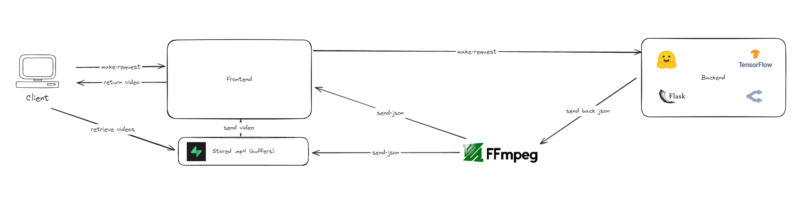

<br />
<div align="center">
  <a href="#">
    
  </a>

<h3 align="center">
    Jelly HeadStarter Hackathon
</h3>
  <p align="center">
    Third Hackathon for Jelly with HeadStarter AI. Targeting JellyJelly.com requirements and specifications for the duration of the Hackathon.
    <br />
    <div align="center">
        <a href="#">Report Bug</a>
        ✱
        <a href="#">Request Feature</a>
        ✱
        <a href="#">Documentation</a>
    </div>
  </p>
</div>
<br>

> [!WARNING] 
> This project is a Hackathon submission for JellyJelly for HeadStarter AI, a fellowship program dedicated to provide opportunities for the next generation. This project is a transcriber for JellyJelly.com and intended as a feature, and is currently still under development.

## Architecture Diagram


## Table of Contents

- [Architecture Diagram](#architecture-diagram)
- [Table of Contents](#table-of-contents)
- [Getting Started](#getting-started)
  - [Prerequisites](#prerequisites)
  - [Installation](#installation)
  - [Usage](#usage)
- [License](#license)

## Getting Started

This is a general step-by-step guide on how to get the application up and running on your own machine, for development or for any testing purposes you may refer to the documentation for more information.

### Prerequisites

To be able to run the application, you should have the following installed on your machine:
- [Node.js](https://nodejs.org/en/)
- [npm](https://www.npmjs.com/)
- [Git](https://git-scm.com/)
- [Vercel CLI](https://vercel.com/download)
- [Next.js](https://nextjs.org/)
- [ffmpeg](https://ffmpeg.org/)
- [axios](https://axios-http.com/)
- [Prisma](https://www.prisma.io/)
- [ESLint](https://eslint.org/)

### Installation

Firstly, clone the repository:
```bash
git clone https://github.com/NautilusAI/Customer-Support-AI.git .
```

> **NOTE**: The `.` at the end of the command clones the repository into the current directory, rather than creating a new directory with the name of this repo.

First, navigate to the directory where the frontend is stored, and install the dependencies found within the `package.json` file:
```bash
cd ./frontend | cd .\frontend\
```

Next, install the dependencies found within the `package.json` file:
```bash
npm install | npm i
```

You should now be able to run the application locally, I suggest using the `run.cmd` command to start the application:
```bash
.\run.cmd
```

But you can also just the application using the following commands:
```bash
npm run dev
```

if you don't intend to use `npm`, you can also use `yarn`, `pnpm`, or `bun` to run the application (or any other package manager you prefer):

```bash
yarn dev
# or
pnpm dev
# or
bun dev
```
> **NOTE**: If the command doesn't exist, or there are some issues, please check the `package.json` file for the correct command.

### Usage

To use the application, you can navigate to the following URL:
```bash
http://localhost:3000
```

> **NOTE**: All applications build using Next.js will usually run on port `3000`, but this can be changed within the `next.config.js` file. 

## License

This project is licensed under the GNU General Public License v3.0 - see the [LICENSE](LICENSE) file for details.

[](https://opensource.org/licenses/MIT)